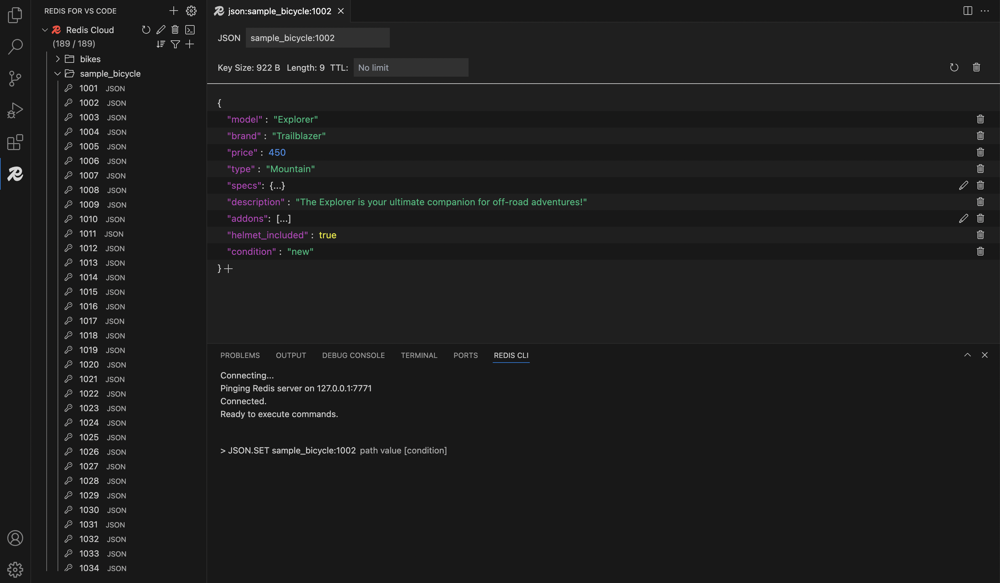

#   Redis for VS Code

Redis for VS Code is the official Visual Studio Code extension that provides an intuitive and efficient GUI for Redis databases, developed by Redis.

## Key features:
* Universal Redis Support: Connect to any Redis instance, including Redis Community Edition, Redis Cloud, Redis Software, and Redis on Azure Cache.
* Advanced Connectivity: Supports TLS certificates and SSH tunnels, with an option for automatic data decompression for GZIP, SNAPPY, Brotli, and more.
* Data types: Supports strings, hashes, lists, sets, sorted sets, and JSON.
* Human-readable data representation: Offers formatters like ASCII, JSON, Binary, Hex, 32-bit, and 64-bit vectors, and other.
* Integrated Redis CLI: Leverage Redis CLI with syntax preview as you type commands.

For more details, check out the [release notes](https://github.com/RedisInsight/Redis-for-VS-Code/releases). 

## Get started with Redis for VS Code

This repository contains the source code for the Redis for VS Code extension. To start using the extension, install it from the [Visual Studio Code Marketplace](https://marketplace.visualstudio.com/items?itemName=redis.redis-vscode).

## Feedback

We welcome your feedback and contributions to make Redis for VS Code even better. Here’s how you can get involved:

* Suggest a new [feature](https://github.com/RedisInsight/Redis-for-VS-Code/issues/new?assignees=&labels=&projects=&template=feature_request.md&title=)
* Upvote [popular feature requests](https://github.com/RedisInsight/Redis-for-VS-Code/issues?q=is%3Aissue+is%3Aopen+sort%3Acomments-desc)
* Report a [bug](https://github.com/RedisInsight/Redis-for-VS-Code/issues/new?assignees=&labels=&projects=&template=bug_report.md&title=%5BBUG%5D)

## Telemetry

Redis for VS Code includes an opt-in telemetry system to help us improve the developer experience. We respect your privacy — any data collected is anonymized. You can disable telemetry at any time via the extension’s settings page.

## License 
Redis for VS Code is licensed under the [SSPL](/LICENSE).
